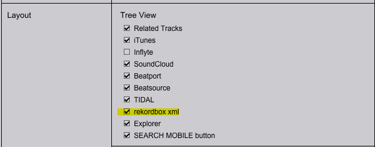
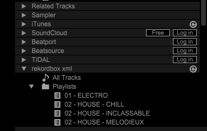
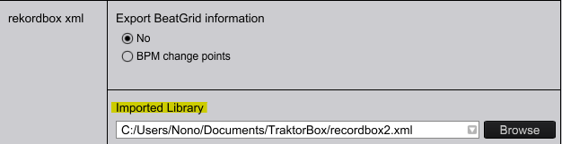
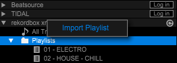

# Traktor Box v1.0

## Description

Tool used to parse XML collections file from a DJing software to another one (currently working for Traktor v3.0.0 and RecordBox v6.6.3 on Windows 11 platform).

I use it for my personal usage because I create my playlists and I mix at home on Traktor, but when I go outside I need to export my USB key in Recordbox format, so I need to convert all my Traktor playlists to Recordbox.

### Features

- [x] : Working on Windows 10 & 11 Traktor v3.0.0 and RecordBox v6.6.3
- [x] : Read Traktor and Recordbox collection
- [x] : Transfer Traktor playlists --> Recorbox playlists
- [x] : Transfer Recorbox playlists --> Traktor playlists

### Incoming Features

- [ ] : Transfer and update songs attributes (CUE, Comment, Mark, ...)
- [ ] : Add GUI interface (PyQt6)

## Configuration of DJing softwares
1. First, you need to have all your song collection updated from both softwares. That means you should have scanned the same musics folders on both software

2. Configure Recordbox to receive collection from outside xml
   
   1. File - Preference - View - Layout: Check "recordbox.xml"
   
      

      The recordbox xml options should be available on the left side of the browser:

      

   2. File - Preference - Advanced - Database: Choose the recordbox.xml file path that you will use in TraktorBox

      

3. Export recordbox collection to .xml and save it to the path you chose in the previous step (File - Export collection to .xml)
   
4. You don't need to export the Traktor collection. The default path is : `C:\Users\User_Name\Documents\Native Instruments\Traktor 3.0.0\collection.nml`
   
5. Close programs
   
## Usage

1. Make sure Traktor and Recordbox are closed
   
2. Make sure to have **all songs** scanned (not necessary analysed) in both collection file. For example, if you add news songs to Traktor, you need to export Recorbox collection with the news songs added. If you want to add a song from Traktor to Recordbox that is not in the Recordbox collection, it will raise an Exception
   
3. Make sure the playlists you want to import have **differents names** than the ones in the current collection. Otherwise Traktor or Recordbox will not be able to read your file
   
4. Informs the collection access paths in `main.py` thanks to the constants `RECORDBOX_COLLECTION_PATH` and `TRAKTOR_COLLECTION_PATH`

### Perform a playlist migration from Traktor to Recordbox

```python
# Get Traktor collection
traktor_parser = TraktorParser(TRAKTOR_COLLECTION_PATH, verbose=True)

# Remove _LOOPS and _RECORDINGS from traktor playlist
traktor_playlists = traktor_parser.playlists[:-2]

# Get Recordbox collection
record_parser = RecordBoxParser(RECORDBOX_COLLECTION_PATH, verbose=True)

# Save traktor playlist to RecordBox collection
record_parser.add_playlists_to_tree(traktor_playlists)

# Save RecordBox Collection
record_parser.save_file()
```
Launch Recordbox and click on the Refresh button next to recordbox xml on the left side of the browser. You can now import the playlists folder:



### Perform a playlist migration from Recordbox to Traktor

```python
# Get Recordbox collection
record_parser = RecordBoxParser(RECORDBOX_COLLECTION_PATH, verbose=True)

# Get Traktor collection
traktor_parser = TraktorParser(TRAKTOR_COLLECTION_PATH, verbose=True)

# Save RecordBox playlists to Traktor Collection
traktor_parser.add_playlists_to_tree(record_parser.playlists)

# Save Traktor Collection
traktor_parser.save_file()
```

Open Traktor, the new playlists appear in the collection. You made a mistake or the `collection.nml` is corrupted ? A backup file named `collection.nml.bak` was created on the same folder as the `collection.nml` file, you can use it as a second chance !

## What about next ?

Any questions, suggestions, bug ? Feel free to contact me, it will be a pleasure to exchange with you.